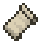

<h1 align="center"> Hiya! McBrincie212 Here 👋</h1>

I just make computers go <i>beep boop</i> to produce silly projects
  

Im a professional developer (certified idiot) and i mostly have spherical knowledge of most fields but i specialize in **backend development**, **frontend development** (to a certain degree), **systems design** and **software engineering**. I am a fast learner, capable of learning paradigms, frameworks, programming languages swiftly and productively. 

I mostly work on some random silly projects but sometimes i do tackle large complex ones (some of them are in the pinned repos section). I try my best to make each of my products i produce as masterfully crafted as i can 
- Current Working Project: [ChronoGrapher](https://github.com/GitBrincie212/ChronoGrapher)
- Pronouns: he/him

<h2 align="center">My Main Used Programming Languages (Ordered)</h2>

  

 
<h2 align="center">Familiar Technologies (Ordered)</h2>

  
  
  
  
  
  
  
  
  
  
  
  
  
  
  
  
  
  
  
  
  
  
  
  
  
  
  
  
  
  

 
<h2 align="center">My Streaks And Other Relevant Information</h2>

  
  
  

